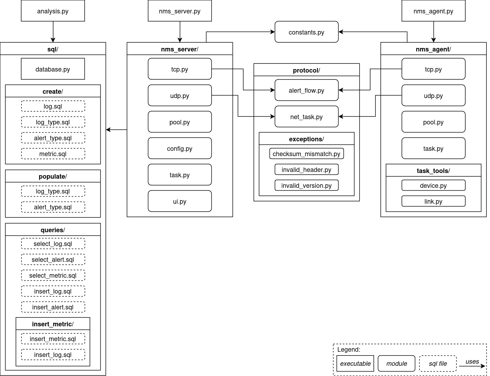

# Network Monitoring System (NMS)

A network monitoring system to monitor device and network metrics,
implemented in Python within Computer Communications environment in 2024/2025 academic year.

- [Project Requirements](project.pdf)
- [Report](report/output/main.pdf)

## Project Architecture

## Aplicacional Protocols

### *NetTask* (UDP)

### *AlertFlow* (TCP)

Types of Alerts:
1. CPU Usage
2. RAM Usage
3. Interface Stats
4. Packet Loss
5. Jitter

## Authors

**NMS** was developed by the following team of students:
- [Flávia Araújo](https://github.com/flaviaraujo)
- [Joshua David](https://github.com/CheirosoOficial)
- [Miguel Carvalho](https://github.com/migueltc13)

#### Final Grade: 18/20
