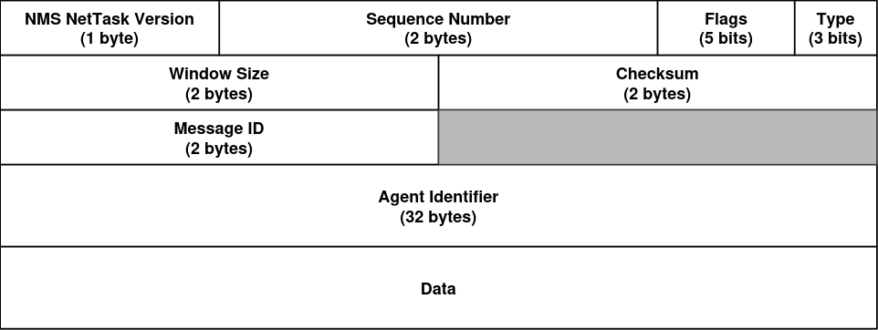

# CC

A network monitoring system to monitor device and network metrics,
implemented in Python within Computer Communications environment in 2024/2025 academic year.

- [Project Requirements](project.pdf)
- [Report](report/output/main.pdf)

## Architecture

## Protocolos Aplicacionais

### *NetTask* (UDP)

### *AlertFlow* (TCP)

Types of Alerts:
1. CPU Usage
2. RAM Usage
3. Interface Stats
4. Packet Loss
5. Jitter

### Libraries

- json
- iperf
- psutil
- subprocess
